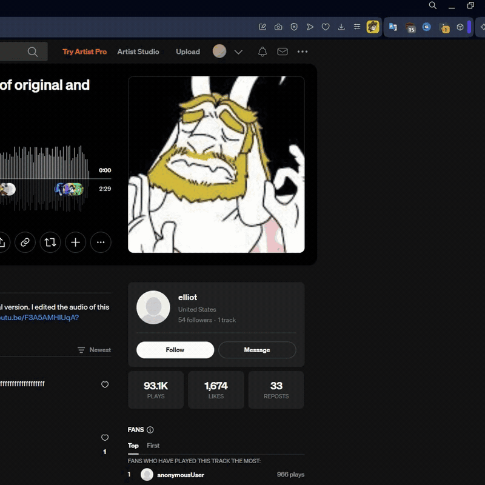
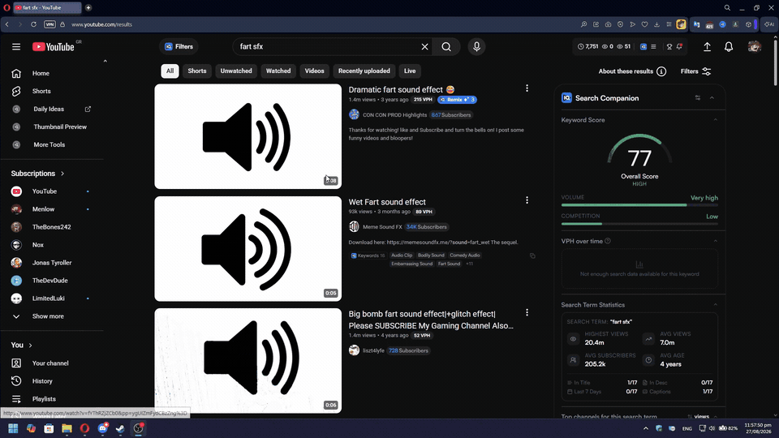
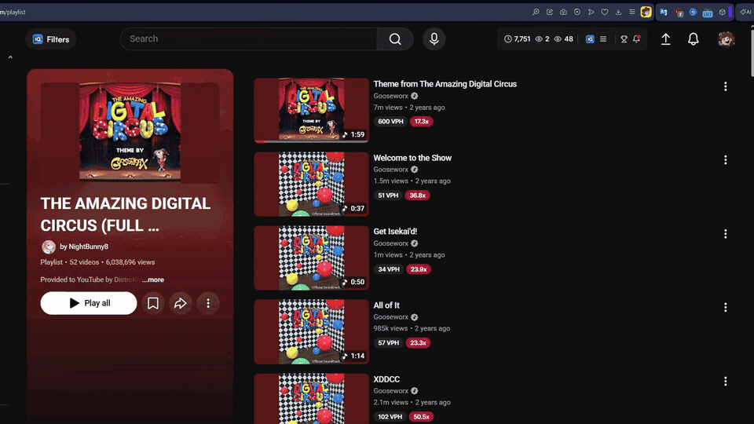
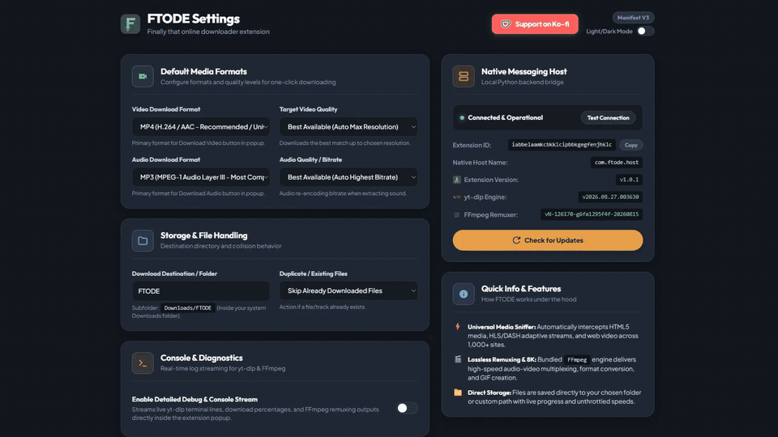

# Finally That Online Downloader Extension (FTODE)

A simple browser extension + Python backend that lets you download video and audio from almost any website (YouTube, SoundCloud, Vimeo, Twitch, Reddit, and more) with 1 click.

 

  

*Effortless 1-click downloads with live speed, progress percentage, and console output.*

Yes I use Opera Don't Judge me xP

---

## ✨ Features

- **1-Click Downloads:** Download video (MP4/WEBM/MKV) or music (MP3/FLAC/WAV) with a single click.
- **Playlist & Batch Downloads:** Download entire playlists and albums in 1 click.
- **Multi-Site Support:** Works seamlessly on YouTube, SoundCloud, Vimeo, Twitch, Reddit, and hundreds more.
- **Zero Setup for Tools:** You don't need to manually install Python, `yt-dlp`, or `ffmpeg`. The setup script configures everything for you automatically!
- **Auto Stream Detection:** Detects videos playing on the page and direct stream links.
- **Dark & Light Mode:** Looks clean and matches your style.
- **Customizable:** Change download formats, quality (up to 8K), and choose where your files get saved.
- **Live Progress:** Shows download speed, percentage, and ETA in the popup.

> ⚠️ **Note on DRM-Protected Websites:**  
> FTODE **does not support DRM-encrypted platforms** (such as **Spotify**, **Netflix**, **Disney+**, **Apple Music**, etc.) because they use Widevine DRM protection.

### 🌐 Works Across Your Favorite Platforms
Download from SoundCloud, Vimeo, Twitch, Reddit, and more:

  

---

## 🚀 How to Install

### What you need:
- **Windows 10/11** or **Linux**
- **A Web Browser** (Chrome, Edge, Opera, Opera GX, Brave, Firefox, etc.)

*(All backend requirements — Python, `yt-dlp`, and `ffmpeg` — are handled automatically by the setup script!)*

---

### Step 1: Add Extension to your Browser
1. Open your browser extensions page:
   - **Chrome / Chromium / Brave:** `chrome://extensions`
   - **Edge:** `edge://extensions`
   - **Opera / Opera GX:** `opera://extensions`
   - **Firefox:** `about:debugging#/runtime/this-firefox`
2. Turn on **Developer mode** (top right switch).
3. Load the extension:
   - **Chrome / Opera / Edge / Brave:** Click **Load unpacked** and select the `extension` folder (or drag & drop `FTODE-Extension-Chrome.zip`).
   - **Firefox:** Click **Load Temporary Add-on...** and select `manifest.firefox.json` in the `extension` folder (or select `FTODE-Extension-Firefox.zip`).
4. Pin the extension to your toolbar so you can click it easily.

---

### Step 2: Run Setup
- **Windows:** Double-click **`setup.bat`** *(it automatically verifies and sets up Python, `yt-dlp`, and `ffmpeg` if needed, and connects the browser).*
- **Linux:** Open a terminal in this folder and run **`bash setup.sh`** *(on Linux, make sure `python3` and `ffmpeg` are installed via your distro's package manager).*

It will connect the extension with the backend engine. Done!

---

### Step 3: Download Stuff!
1. Go to any video or music page (YouTube, SoundCloud, Vimeo, etc.).
2. Click the **FTODE** icon in your toolbar.
3. Click **Download MP4**, **Download MP3**, or **Download Playlist**.
4. The files will be saved in your `Downloads/FTODE` folder!

#### 🎵 1-Click Audio & Music Download:

  

#### 📋 Full Playlist & Batch Downloads:

  

---

## ⚙️ Settings

Right-click the extension icon and choose **Options** (or click the gear icon in the popup):
- Pick your preferred video quality & format (MP4, WEBM, MKV, GIF, etc.).
- Pick your preferred audio format (MP3, FLAC, WAV, OPUS, etc.).
- Set a custom download folder (like `D:\Downloads\FTODE` or `~/Videos/FTODE`).
- Click "Check for Updates" to update `yt-dlp` and `ffmpeg` anytime.

  

---

## 🗑️ How to Uninstall

1. Run the uninstaller:
   - **Windows:** Double-click **`uninstall.bat`**
   - **Linux:** Run **`bash uninstall.sh`**
2. Right-click the extension icon in your browser and click **Remove from Chrome/Firefox**.

---

## 📦 Building Releases (Optional)

If you want to package the project into zip files to share:
- Run **`build.bat`** (or `python build.py`).
- It automatically creates standalone release bundles in `dist/`:
  - **`FTODE-v1.0.2-Windows.zip`** (for Windows users)
  - **`FTODE-v1.0.2-Linux.zip`** (for Linux users)
  - **`FTODE-Extension-Chrome-v1.0.2.zip`** (Chrome / Chromium extension)
  - **`FTODE-Extension-Firefox-v1.0.2.zip`** (Firefox extension)

---

## 💖 Credits & Support

If you like this project, feel free to support me :> :

- **Made by:** MaxAkt
- **AI Disclosure:** This project was developed with the help of AI coding assistance.
- **Powered by:**
  - [yt-dlp](https://github.com/yt-dlp/yt-dlp) — Media downloader
  - [FFmpeg](https://ffmpeg.org) — Audio/Video converter

---

## 📄 License

This project is open-source under the [GNU General Public License v3.0 (GPLv3)](LICENSE).
